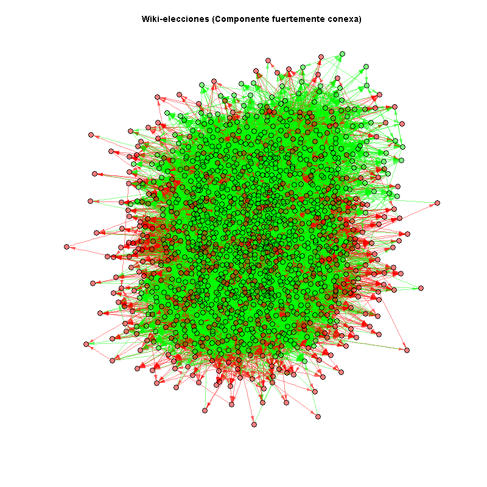
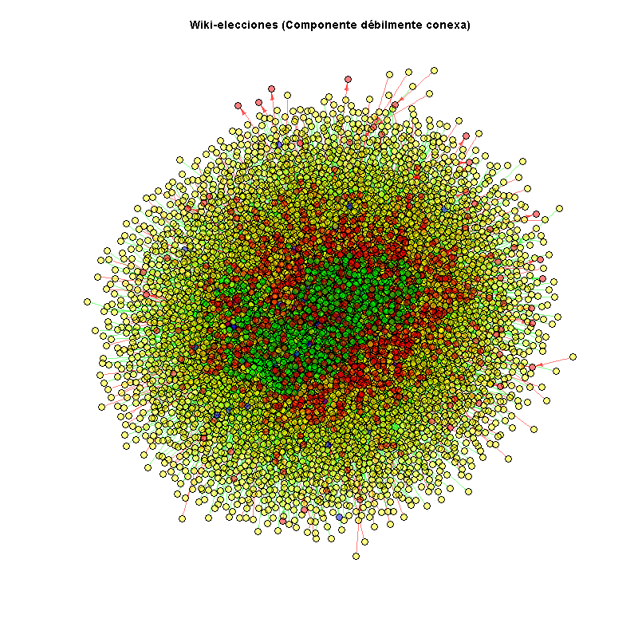
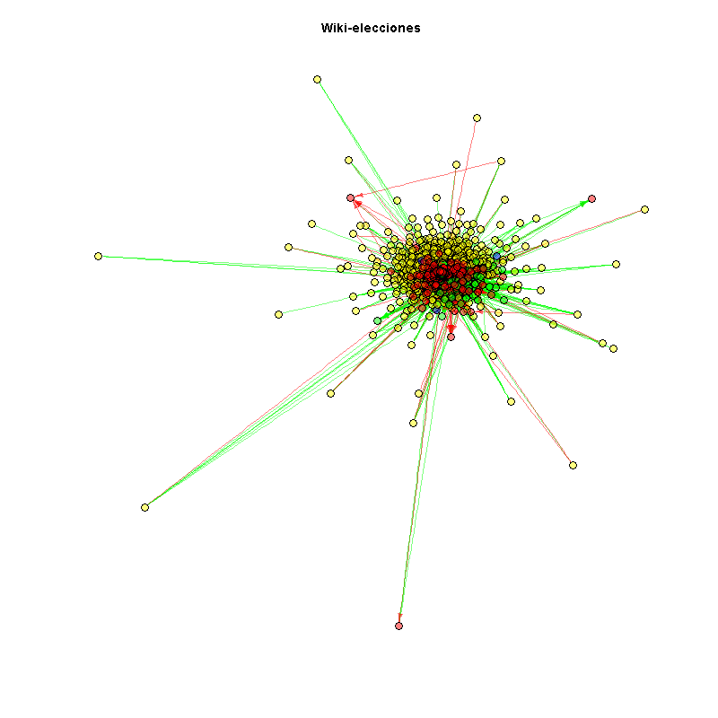

### Introducción

Wikipedia es una enciclopedia libre escrita colaborativamente por voluntarios alrededor del mundo. Una parte de estos contribuidores son administradores, usuarios especiales con capacidad para ayudar en el mantenimiento. Cuando un usuario quiere convertirse en administrador, hace una petición para ello, y la comunidad vota si acepta la petición. Usando un dump de la Wikipedia, extraemos todas las elecciones hasta enero de 2008. Esto nos da cerca de 2800 elecciones y más o menos 100.000 votos de 7.000 usuarios que participan en las elecciones. 

El ejercicio se entregará en el HTML generado por Markdown mostrando todos los chunks de código y se enviará por email antes del 13 de octubre de 2016 a las 23:59.

Para obtener más información sobre R Markdown, leed. http://rmarkdown.rstudio.com/articles.html.

<span style="color:blue">
Las contestaciones y explicaciones (fuera del código) están en azul.
</span>

### Inicialización (setwd() y rm() y packages):

```{r}
# setwd(getwd())
try(setwd('C:/Users/jtoharia/Dropbox/AFI_JOSE/Redes sociales/ejercicio_final'), silent=TRUE)
try(setwd('C:/Personal/Dropbox/AFI_JOSE/Redes sociales/ejercicio_final'), silent=TRUE)
rm(list = ls()) # Borra todos los elementos del entorno de R.

# install.packages("rmarkdown")
# install.packages("igraph")
library(igraph)
# install.packages("dplyr")
library(dplyr) # para el CHUNK 10

# # install.packages("networkD3") # Gráficos interactivos de grafos
# library(networkD3) # Para usar, p.ej. networkD3::renderSimpleNetwork(grf)
# # install.packages("shiny")
# library(shiny) # Para usar, p.ej. networkD3::renderSimpleNetwork(grf)
```

### Carga de datos

Tenemos un fichero con las columnas "voter"-"user"-"timestamp"-"vote". 
En esta sección carga el archivo para guardarlo en un data frame.

```{r}
#CHUNK 1: carga el fichero votings.txt
dat <- read.csv('votings.txt', sep = ';', stringsAsFactors = FALSE)#, nrows = 100)

print(dim(dat))
# Buscamos registros repetidos (duplicados):
if(anyDuplicated(dat) != 0)
{
  # Quitamos duplicados:
  dups <- which(duplicated(dat))
  print(paste0('Quitando ', length(dups), ' registros duplicados...'))
  dat <- dat[-dups,]
}
# Buscamos votos == 0:
if(sum(dat$vote == 0) != 0)
{
  # Quitamos votos == 0:
  print(paste0('Quitando ', sum(dat$vote == 0), ' votos nulos (vote == 0)...'))
  dat <- dat[dat$vote != 0,]
}
# Buscamos bucles:
if(sum(dat$voter == dat$candidate))
{
  # Quitamos bucles:
  print(paste0('Quitando ', length(dat[dat$voter == dat$candidate, 1]), ' bucles...'))
  dat <- dat[dat$voter != dat$candidate,]
}
dat[dat$voter == dat$candidate,]

print(dim(dat))
print(str(dat))
print(summary(dat))
```

<span style="color:blue">
Se han descartado un total de 7.046 registros (aprox. un 6% del total).<br />
NOTA: Descartamos los votos nulos (vote==0) porque son pocos y para no falsear cuentas de votos, etc.
</span>

```{r}
# Verificamos fechas:
dat$year <- substr(dat$timestamp, start = 1, stop = 4)
dat$mon <- substr(dat$timestamp, start = 6, stop = 7)
dat$day <- substr(dat$timestamp, start = 9, stop = 10)
sort(unique(dat$day)) # *** Ok. ***
sort(unique(dat$mon)) # *** Ok. ***
sort(unique(dat$year))
# Corregimos errores en los años, poniendo el año del registro anterior (a falta de más información sobre el fichero):
while(sum(as.numeric(dat$year) > 2016) != 0)
{
  print(paste0('Corrigiendo ', sum(as.numeric(dat$year) > 2016), ' años incorrectos...'))
  err.year.ix <- which(as.numeric(dat$year) > 2016)
  print(dat[err.year.ix,])
  # Remplazamos los años incorrectos con los "corregidos":
  dat[err.year.ix,]$year <- substr(dat[err.year.ix - 1,]$timestamp, start = 1, stop = 4)
  substr(dat[err.year.ix,]$timestamp, start = 1, stop = 4) <- dat[err.year.ix,]$year
  dat$year <- substr(dat$timestamp, start = 1, stop = 4)
}
# Verificamos otra vez (por si acaso):
sort(unique(dat$year)) # *** Ok. ***
# Quitamos columnas sobrantes para no desperdiciar memoria:
dat$year <- NULL
dat$mon <- NULL
dat$day <- NULL
```

<span style="color:blue">
NOTA: Se han corregido las fechas (el año) de 9 registros, poniendo el año del registro anterior porque el fichero parece estar ordenado por fecha en origen.
</span>

### Construye la red

En esta sección, crea el objeto grafo de Igraph a partir del dataframe anterior.

```{r}
#CHUNK 2: genera el grafo y visualiza el resumen
grf <- graph_from_data_frame(d = dat[,1:2], directed = TRUE)
grf$name <- "Wiki-elecciones"

# Añadimos el voto (1 ó -1) como atributo de los enlaces:
E(grf)$voto <- dat$vote
# Añadimos la fecha del voto como atributo de los enlaces:
# Convertimos fecha a POSIXct (valor numérico):
E(grf)$timestamp <- as.POSIXct(dat$timestamp, format = "%Y-%m-%d %H:%M:%S", tz = "GMT")

summary(grf)
```

Describe qué significan todos los campos del resumen.

<span style="color:blue">
Los campos del resumen [summary(grf)] son sus propiedades básicas como grafo en la primera línea y otros atributos en
 las siguientes líneas (si los hubiera).
 <br />
Las 4 letras que hay detrás del tipo ("IGRAPH") en la primera línea son:<br />
  - La primera es "D" o "U" para distinguir entre grafos dirigidos o no dirigidos (directed or undirected)<br />
  - La segunda letra es ‘N’ para los grafos con nombre (named graphs, i.e. grafos con el atributo "name" en los vértices/nodos).<br />
  - La tercera letra es "W" para los grafos ponderados (weighted graphs, i.e. grafos con el atributo "weight" en los enlaces).<br />
  - La cuarte letra es "B" para los grafos "bipartite", i.e. graphs, i.e. for grafoscon el atributo "type" en los vértices/nodos.<br />
  <br />
En este caso, es un grafo Dirigido ("D") y con nombres ("N"), pero no hemos asignado pesos a los nodos (todavía) ni tipo a los nodos.
<br />
A continuación, tras las 4 letras (o guiones "-" si no hay letra), hay dos números que indican, respectivmente, el número de nodos y de enlaces del grafo. En nuestro caso, tenemos 7115 nodos y 106994 enlaces entre ellos.
<br />
Después hay dos guiones y, detrás, el nombre del grafo si se ha asignado el atributo "name" al mismo. En este caso, el nombre es "Wiki-elecciones".
<br />
En la(s) siguiente(s) línea(s) se encuentran los atributos añadidos al grafo y, para cada uno, entre paréntesis, el tipo de atributo (grafo -"g"-, vértice -"v"- o enlace -"e"-) y el tipo de valores del mismo (carácter -"c"-, numérico -"n"-, lógico -"l"-, u otro -"x"-). En este caso, hay 5 attributos: dos "name" de tipo carácter (uno para el grafo y otro para los nodos) y dos atributos de tipo numérico para los enlaces (voto y timestamp).
</span>

### Distribución de grados

Aquí tienes que visualizar la distribución de grados de los nodos en la red. Hazlo para todos los grados diferentes que conozcas. Utiliza escalas logarítmicas y limita los ejes para obtener la mejor visualización posible.

```{r}
#CHUNK 3: calcula los tipos de grado y pinta su distribución
# Distribución de grado:

# print("Enlaces de entrada (IN):")
dens_in<-density(degree(grf, mode = "in"))
# plot(dens_in$x, dens_in$y, main = "Enlaces de entrada (IN)")
plot(dens_in$x, dens_in$y, log="xy", main = "Enlaces de entrada (IN)   [Esc. log. = xy]")
plot(dens_in$x, dens_in$y, log="xy", ylim=c(1e-6,1e-1), main = "Enlaces de entrada (IN)   [Esc. log. = xy (y > 1e-6)]") # escala logarítmica (y > 1e-6)

# print("Enlaces de salida (OUT):")
dens_out<-density(degree(grf, mode = "out"))
# plot(dens_out$x, dens_out$y, main = "Enlaces de salida (OUT)")
plot(dens_out$x, dens_out$y, log="xy", main = "Enlaces de salida (OUT)   [Esc. log. = xy]")
plot(dens_out$x, dens_out$y, log="xy", ylim=c(1e-6,1e-1), main = "Enlaces de salida (OUT)   [Esc. log. = xy (y > 1e-6)]") # escala logarítmica (y > 1e-6)

# print("Enlaces totales (IN + OUT):")
dens_all<-density(degree(grf, mode = "all"))
# plot(dens_all$x, dens_all$y, main = "Enlaces totales (IN + OUT)")
plot(dens_all$x, dens_all$y, log="xy", main = "Enlaces totales (IN + OUT)   [Esc. log. = xy]")
plot(dens_all$x, dens_all$y, log="xy", ylim=c(1e-6,1e-1), main = "Enlaces totales (IN + OUT)   [Esc. log. = xy (y > 1e-6)]") # escala logarítmica (y > 1e-6)
```

Una vez pintados los resultados, ¿crees que es una red libre de escala? Considera usar la función power.law.fit para justificar tu respuesta.

```{r}
#CHUNK 4: muestra estadísticamente si la distribución de grados sigue una ley de escala
power.law.fit(degree(grf, mode = "in"))$KS.p
power.law.fit(degree(grf, mode = "out"))$KS.p
power.law.fit(degree(grf, mode = "all"))$KS.p
```

<span style="color:blue">
Es una red libre de escala ya que la distribución de grados sigue una distribución exponencial negativa. Usamos la función power.law.fit() para contrastarlo y como devuelve un valor KS.p (p-valor del test de Kolmogorov-Smirnov) muy grande, no hay evidencia para rechazar la hipótesis (que afirma que la distribución proviene de una distribución exponencial negativa).
<br />
Realizamos el test con la distribución de grados de entrada, de salida y con la suma de ambas y, como se veía en los gráficos, al ser muy parecidas, se puede afirmar que es una red libre de escala con cualquiera de los 3 tipos de grado, a pesar de incluir un grupo de nodos con muchos enlaces cuya distribución es menos obvia.
</span>

### Reciprocidad

¿Cuál es la reciprocidad global de esta red?
¿Cuántos enlaces recíprocos tiene?

¿Crees que la reciprocidad es una buena medida para esta red?¿Por qué?

```{r}
#CHUNK 5: calcula la reciprocidad
# Probabilidad de que el enlace recíproco (en dirección contraria) a un enlace también esté en el grafo:
numCandidatos <- length(unique(dat$candidate))
numVotantes <- length(unique(dat$voter))
print(paste('Hay', numCandidatos, 'candidatos (distintos).'))
print(paste('Hay', numVotantes, 'votantes (distintos).'))
print(paste('Hay', numCandidatos + numVotantes - vcount(grf), 'candidatos votantes (distintos).'))

print(paste('Reciprocidad =', reciprocity(grf)))
# La cantidad de enlaces dirigidos multiplicada por la probabilidad de ser recíproco es la cantidad de enlaces recíprocos:
print(paste('Enlaces recíprocos =', reciprocity(grf) * ecount(grf) / 2))
# NOTA: Esto también se puede calcular con: dyad.census(grf)$mut

# Probabilidad de que haya enlaces recíprocos entre cada par de nodos conectados (incluyendo los pares de nodos no conectados entre sí):
reciprocity(grf, mode="ratio")
```

<span style="color:blue">
La reciprocidad en este caso es obviamente baja (5,5%) ya que las votaciones se realizan solamente a los que se presentan como candidatos y, al ser éstos muchos menos (2.381) que los votantes (6.110), habrá forzosamente más enlaces hacia candidatos que en dirección contraria (de hecho, solamente 1.376 votantes son también candidatos).<br />
No es una buena medida para esta red, ya que hay una dirección clara en los enlaces (votantes frente a candidatos) y una clara distinción entre los grupos de candidatos y votantes (aún teniendo algunos elementos en ambos grupos). De hecho, la segunda medida de reciprocidad, inferior al 3%, indica mejor lo poco recíproca que es la relación de este grafo, ya que tiene en cuenta también los enlaces no existentes entre cada par de nodos (pares desconectados).
</span>

### Componentes conexas

En esta sección vamos a calcular las componentes conexas del grafo. Analiza qué ocurre cuando se consideran las direcciones de los enlaces y cuando no y explica por qué. Considera utilizar la función clusters de igraph para este ejercicio.

```{r}
#CHUNK 6: analiza cómo son las componentes conexas de este grafo
clus_F <- clusters(grf, mode = "strong")
print(paste(clus_F$no, 'componentes fuertemente conexas (grafo dirigido). Distribución del tamaño de las componentes:'))
table(nodos = clus_F$csize)
```

<span style="color:blue">
Hay una única componente fuertemente conexa (con 1.300 nodos).
</span>

```{r}
clus_D <- clusters(grf, mode = "weak")
print(paste(clus_D$no, 'componentes débilmente conexas (grafo dirigido). Distribución del tamaño de las componentes:'))
table(nodos = clus_D$csize)
```

<span style="color:blue">
También hay 24 componentes débilmente conexas: una con 7.066 nodos, tres con 3 nodos cada una y 20 con dos nodos conectados (débilmente)...
<br />
Si los enlaces no fuesen dirigidos, las componentes conexas serían las 24 débilmente conexas de este último caso. Si no hay dirección en el grafo, no hay conexiones débiles o fuertes, sólo hay conexiones.
</span>

Quédate con el subgrafo que involucra a los nodos contenidos en la componente conexa más grande.

```{r}
#CHUNK 7: crea un subgrafo llamado g2 que esté compuesto solamente por los nodos y enlaces de la componente conexa principal
cluster_principal_id <- which.max(clus_F$csize)
g2.F <- induced_subgraph(grf, which(clus_F$membership == cluster_principal_id))
g2.F$name <- paste(g2.F$name,'(Componente fuertemente conexa)')
summary(g2.F)

cluster_principal_id <- which.max(clus_D$csize)
g2.D <- induced_subgraph(grf, which(clus_D$membership == cluster_principal_id))
g2.D$name <- paste(g2.D$name,'(Componente débilmente conexa)')
summary(g2.D)

# Nos quedamos con la componente débilmente conexa principal, ya que es obviamente la más grande:
g2 <- g2.D
```

### Caminos mínimos

Calcula el diámetro y el camino medio en el grafo original y en el subgrafo generado en el paso anterior. ¿Puedes explicar las diferencias y similaridades? ¿Dirías que es una red de mundo pequeño?

<span style="color:blue">
Primero comprobamos la red inicial completa (grf):
</span>

```{r}
#CHUNK 8: calcula el camino medio y el diámetro para explicar si es una red de mundo pequeño o no
diam_grf <- diameter(graph = grf, directed = TRUE, unconnected = TRUE, weights = NULL)
print(paste('Diámetro de grf =', diam_grf))

dist_media_grf <- mean_distance(graph = grf, directed = TRUE, unconnected = TRUE) # == L
print(paste('Camino medio (L) de grf =', dist_media_grf))

clust_coef_grf <- transitivity(grf) # == C
print(paste('Transitividad (C) de grf =', clust_coef_grf))

# Es libre de escala, así que esta diferencia no debería ser muy grande:
print(paste('L ~ log(log(N)):', dist_media_grf, '~', log(log(vcount(grf)))))

# Generamos un grafo aleatorio con mismo número de nodos y de enlaces (7.115 nodos y 106.994 enlaces):
mi_tiempo <- system.time({
  grf_rand <<- random.graph.game(n = vcount(grf), p.or.m = ecount(grf),
                                 type = "gnm", loops = FALSE, directed = TRUE)
  dist_media_grf_rand <<- mean_distance(graph = grf_rand, directed = TRUE
                                       , unconnected = !is.connected(grf_rand, "strong")) # == L_Rand
})
print(paste0("Tiempo grf_rand: ", round(mi_tiempo[3],1), " segundos."))

print(paste('Camino medio de grf_rand =', dist_media_grf_rand))

clust_coef_grf_rand <- transitivity(grf_rand) # == C_Rand
print(paste('Transitividad (C_Rand) de grf_rand =', clust_coef_grf_rand))

coef_mundo_peq_grf <- (clust_coef_grf / clust_coef_grf_rand) / (dist_media_grf / dist_media_grf_rand)
print(paste('Coeficiente de mundo pequeño de grf =', coef_mundo_peq_grf))
```

<span style="color:blue">
Ahora vamos con la componente (débilmente) conexa g2:
</span>

```{r}
diam_g2 <- diameter(graph = g2, directed = TRUE, unconnected = TRUE, weights = NULL)
print(paste('Diámetro de g2 =', diam_g2))

dist_media_g2 <- mean_distance(graph = g2, directed = TRUE, unconnected = TRUE) # == L
print(paste('Camino medio (L) de g2 =', dist_media_g2))

clust_coef_g2 <- transitivity(g2) # == C
print(paste('Transitividad (C) de g2 =', clust_coef_g2))

# Es libre de escala, así que esta diferencia no debería ser muy grande:
print(paste('L ~ log(log(N)):', dist_media_g2, '~', log(log(vcount(g2)))))

# Generamos un grafo aleatorio con mismo número de nodos y de enlaces (7.066 nodos y 106.968 enlaces):
mi_tiempo <- system.time({
  g2_rand <<- random.graph.game(n = vcount(g2), p.or.m = ecount(g2),
                                type = "gnm", loops = FALSE, directed = TRUE)
  dist_media_g2_rand <<- mean_distance(graph = g2_rand, directed = TRUE
                                       , unconnected = !is.connected(g2_rand, "weak")) # == L_Rand
})
print(paste0("Tiempo g2_rand: ", round(mi_tiempo[3],1), " segundos."))

print(paste('Camino medio de g2_rand =', dist_media_g2_rand))

clust_coef_g2_rand <- transitivity(g2_rand) # == C_Rand
print(paste('Transitividad (C_Rand) de g2_rand =', clust_coef_g2_rand))

coef_mundo_peq_g2 <- (clust_coef_g2 / clust_coef_g2_rand) / (dist_media_g2 / dist_media_g2_rand)
print(paste('Coeficiente de mundo pequeño de g2 =', coef_mundo_peq_g2))

```

<span style="color:blue">
Ambos grafos tienen el mismo diámetro y prácticamente el mismo camino medio (distancia media). Este es debido a que en el grafo original hay muy pocas componentes (débilmente) conexas y son muy pequeñas comparadas con la principal, que es el subgrafo g2.
<br />
Ambos grafos tienen pequeñas distancias medias pero no altos coeficientes de clustering. Las pequeñas distancias medias junto con altos coeficientes de clustering también caracterizan a las redes de mundo pequeño. Pero aún no siendo así en este caso, también se trata de redes de mundo pequeño al ser libres de escala y, por tanto, L ~ log(log(N)), donde L es la distancia media entre dos nodos elegidos al azar y N es el número de nodos.
<br />
La mayor geodésica (diámetro) en ambas redes es también pequeña (10/10) frente al número de nodos (7.115/7.066).
<br />
Tras generar un grafo aleatorio con los mismos nodos y enlaces, calculamos sus coeficientes de clustering (transitividad) y distancia media para calcular con ellos la medida de mundo pequeño de cada grafo: (C / CRand) / (L / LRand)<br />
Para las dos redes, obtenemos valores mucho mayores que 1 (31,2 y 31,9) lo cual confirma que son redes de mundo pequeño.
</span>

### Centralidad

Vamos a comparar la betweenness y el grado para los nodos de este grafo. ¿Cuáles son las diferencias que observas entre ambas?

```{r}
#CHUNK 9: visualiza la betweenness frente al grado para analizar las diferencias y explícalas.
betw_grf <- betweenness(grf, directed = T)
grado_grf <- degree(grf, mode = "all")

summary(betw_grf)
summary(grado_grf)

print(paste0('Hay ', sum(betw_grf==0), ' nodos (el ', round(100 * sum(betw_grf==0) / vcount(grf), 0), '%) con betweenness nula'))
print('Distribución de los grados de estos nodos con betweenness nula:')
print(summary(grado_grf[betw_grf==0]))

# Gráfico:
plot(x = grado_grf, y = betw_grf, xlim = c(0, 500), ylim = c(0, 150000))
plot(x = grado_grf, y = 1+betw_grf, log = "xy") # NOTA: Usamos 1 + betweenness para evitar log(0)
# Calculamos la correlación entre ambas medidas:
cor(betw_grf, grado_grf)
# Calculamos la correlación entre los logaritmos de ambas medidas:
# (excluyendo los nodos con betweenness nula)
cor(log(betw_grf[betw_grf != 0]), log(grado_grf[betw_grf != 0]))
```

<span style="color:blue">
Limitando el eje y (la betweenness) se puede ver que un 80% de nodos tiene betweenness nula, es decir, no están conectados a la componente conexa principal. Sin embargo, todos ellos están conectados: el grado medio de estos nodos es mayor que 13 (con un máximo de 810), aunque la mediana es 2, por lo que se trata de muchas componentes conexas pequeñas.
<br />
Aún así, hay una correlación bastante alta entre ambas medidas (0,69) y que es mucho mayor (0,82) si tenemos en cuenta los logaritmos de ambas medidas (y solamente de los 7.115 - 5.740 = 1.375 nodos con betweenness no nula).
</span>

```{r}
# Ahora miramos la componente principal (fuertemente) conexa (g2.F):
betw_g2.F <- betweenness(g2.F, directed = T)
grado_g2.F <- degree(g2.F, mode = "all")

print(paste0('Hay ', sum(betw_g2.F==0), ' nodos (el ', round(100 * sum(betw_g2.F==0) / vcount(g2.F), 0), '%) con betweenness nula'))
print('Distribución de los grados de estos nodos con betweenness nula:')
print(grado_g2.F[betw_g2.F==0])

plot(x = grado_g2.F, y = betw_g2.F, xlim = c(0, 300), ylim = c(0, 20000))
plot(x = grado_g2.F, y = 1+betw_g2.F, log = "xy") # NOTA: Usamos 1 + betweenness para evitar log(0)
# Calculamos la correlación entre ambas medidas:
cor(betw_g2.F, grado_g2.F)
cor(log(betw_g2.F[betw_g2.F != 0]), log(grado_g2.F[betw_g2.F != 0]))
```

<span style="color:blue">
En la componente fuertemente conexa principal (g2.F), se ve más claramente la correlación, mucho mayor (0,77), entre el grado y la betweenness de sus 1.300 nodos. De hecho, como se ve en los gráficos, la correlación es mucho más clara (0,84) entre los logaritmos de ambas medidas (excluyendo en este caso 3 nodos que tienen betweenness nula).
</span>

```{r}
# Ahora miramos la componente principal (débilmente) conexa (g2 = g2.D):
betw_g2 <- betweenness(g2, directed = FALSE)
grado_g2 <- degree(g2, mode = "all")

print(paste0('Hay ', sum(betw_g2==0), ' nodos (el ', round(100 * sum(betw_g2==0) / vcount(g2), 0), '%) con betweenness nula'))
print('Distribución de los grados de estos nodos con betweenness nula:')
print(summary(grado_g2[betw_g2==0]))

plot(x = grado_g2, y = betw_g2, xlim = c(0, 500), ylim = c(0, 150000))
plot(x = grado_g2, y = 1+betw_g2, log = "xy") # NOTA: Usamos 1 + betweenness para evitar log(0)
# Calculamos la correlación entre ambas medidas:
cor(betw_g2, grado_g2)
cor(log(betw_g2[betw_g2 != 0]), log(grado_g2[betw_g2 != 0]))
```

<span style="color:blue">
En la componente débilmente conexa principal (g2.D) usamos la betweenness sin dirección (ya que con dirección se parece mucho al grafo original). Tambíen hay una fuerte la correlación, mucho mayor (0,80), entre el grado y la betweenness de sus 7.066 nodos. De hecho, como se ve en los gráficos, la correlación es mucho más clara (0,92) entre los logaritmos de ambas medidas (excluyendo en este caso 2.471 nodos que tienen betweenness nula).
</span>

### Visualización de grafos

Utiliza el layout llamado layout.lgl para visualizar la red y colorea los nodos dependiendo de <br> 
i) si eran candidatos y ganaron la votación (verde) <br> 
ii) fueron candidatos y no ganaron la votación (rojos) <br> 
iii) pinta los mentores azul y <br> 
iv) los que solamente votan en amarillo. 

Para detectar los candidatos, mentores (nominators) y el resultado de la votación, utiliza el fichero metadata.txt adjunto.

```{r}
#CHUNK 10: visualiza la red con las condiciones dadas.
meta_dat <- read.csv('metadata.txt', sep = ';', stringsAsFactors = FALSE)#, nrows = 100)
str(meta_dat)
print(paste0('los resultados posibles de la votación son: (', paste0(
  unique(meta_dat$result)
    , collapse = ','), ')'))
# meta_dat$candidate
# meta_dat$nominator
# meta_dat$deadline
# meta_dat$result
print('Verificamos fechas:')
md.year <- substr(meta_dat$deadline, start = 1, stop = 4)
md.mon <- substr(meta_dat$deadline, start = 6, stop = 7)
md.day <- substr(meta_dat$deadline, start = 9, stop = 10)
sort(unique(md.day)) # *** Ok. ***
sort(unique(md.mon)) # *** Ok. ***
sort(unique(md.year)) # *** Ok. ***
# Convertimos fecha a POSIXct (valor numérico):
meta_dat$deadline <- as.POSIXct(meta_dat$deadline, format = "%Y-%m-%d %H:%M:%S", tz = "GMT")

print(paste('Hay', length(unique(paste(meta_dat$candidate))), 'candidatos distintos y', nrow(meta_dat), 'votaciones.'))

print('NOTA: Nos quedamos con la última votación de cada candidato y usaremos ese resultado.')
# Obtenemos la última fecha de cada candidato:
meta2_dat <- meta_dat %>% group_by(candidato=candidate) %>% summarize(fecha=max(deadline))
# Construimos el resto del data.frame con los datos de cada candidato:
meta2_dat <- merge(x = meta2_dat, y = meta_dat, all.x = TRUE, all.y = FALSE
      , by.x = c("candidato", "fecha"), by.y = c("candidate", "deadline"))

```

<span style="color:blue">
Creamos fichero con gráfico de cada red (la red inicial completa y las dos sub-redes creadas a partir de las componentes débil y fuertemente conexas principales)
</span>

```{r}
##########################################
# Creamos fichero con gráfico de cada red:
##########################################

grf$nombre_fichero <- "practica_redes_jjtz_full.png"
g2.D$nombre_fichero <- "practica_redes_jjtz_debil.png"
g2.F$nombre_fichero <- "practica_redes_jjtz_fuerte.png"
# Eliminamos gráficos para volver a generarlos (entre 5 y 10 minutos cada uno!!!)
# NOTA: Comentar estas líneas para no volver a generarlos (layout+plot)
try(if(file.exists(grf$nombre_fichero)) file.remove(grf$nombre_fichero), silent=TRUE)
try(if(file.exists(g2.D$nombre_fichero)) file.remove(g2.D$nombre_fichero), silent=TRUE)
try(if(file.exists(g2.F$nombre_fichero)) file.remove(g2.F$nombre_fichero), silent=TRUE)

for(grf_plot in list(grf, g2.D, g2.F))
{
  print(paste('Visualizando red:', grf_plot$name, '-', grf_plot$nombre_fichero))
  # Construimos un nuevo data.frame con estos filtrando solo los candidatos de grf_plot:
  df_vg <- data.frame(candidato=V(grf_plot)$name)
  V_meta2_dat <- merge(x = df_vg, y = meta2_dat, all.x = TRUE, all.y = FALSE
        , by = "candidato")
  # Y lo ponemos en el mismo orden que V(grf_plot)
  V_meta2_dat <- meta2_dat[match(x = V(grf_plot)$name, table = meta2_dat$candidato),]
  
  head(V(grf_plot))
  head(V_meta2_dat)
  
  # Finalmente, guardamos esos datos como atributos en el grafo (en los vértices):
  V(grf_plot)$es_candidato <- (V(grf_plot)$name %in% meta_dat$candidate)
  V(grf_plot)$es_mentor <- (V(grf_plot)$name %in% meta_dat$nominator)
  V(grf_plot)$resultado       <- ifelse(is.na(V_meta2_dat$result), -1, V_meta2_dat$result)
  # # Estos dos no hacen falta:
  # V(grf_plot)$mentor          <- V_meta2_dat$nominator
  # V(grf_plot)$fecha_resultado <- V_meta2_dat$fecha
  
  print(paste(sum(V(grf_plot)$es_candidato), 'candidatos'))
  print(paste(sum(V(grf_plot)$es_mentor), 'mentores'))
  print(paste(nrow(df_vg) - sum(V(grf_plot)$es_candidato | V(grf_plot)$es_mentor), 'solo votantes'))

  print(paste(sum(V(grf_plot)$resultado == 1),'candidatos ganaron la (última) votación'))
  print(paste(sum(V(grf_plot)$resultado == 0),'candidatos perdieron la (última) votación'))
  print(paste(sum(V(grf_plot)$resultado == -1),'no candidatos'))
  
  summary(grf_plot)
  
  # Finalmente, pintamos el grafo (grf_plot):
  # i) si eran candidatos y ganaron la votación (verde) <br> 
  # ii) fueron candidatos y no ganaron la votación (rojos) <br> 
  # iii) pinta los mentores azul y <br> 
  # iv) los que solamente votan en amarillo. 
  rojo <- rgb(1,0,0,0.5)
  verde <- rgb(0,1,0,0.5)
  azul <- rgb(0,0,1,0.5)
  amarillo <- rgb(1,1,0,0.5)
  # Colores para los vértices:
  v_color <- ifelse(V(grf_plot)$es_candidato & V(grf_plot)$resultado == 1, verde,
                    ifelse(V(grf_plot)$es_candidato & V(grf_plot)$resultado == 0, rojo,
                           ifelse(V(grf_plot)$es_mentor == 1, azul,
                                  amarillo)))
  table(v_color)
  # Colores para los enlaces (verde es positivo y rojo negativo):
  e_color <- ifelse(E(grf_plot)$voto == 1, verde, rojo)
  table(e_color)
  
  if(!file.exists(grf_plot$nombre_fichero))
  {
    v_cnt <- vcount(grf_plot)
    mi_tiempo <- system.time({
      ly <<- layout_with_lgl(grf_plot
                      , maxiter = 150
                      , maxdelta = v_cnt
                      , area = v_cnt^2
                      , coolexp = 1.5
                      , repulserad = v_cnt^3
                      , cellsize = sqrt(v_cnt)
                      , root = NULL)
    })
    print(paste0("Tiempo layout(): ", round(mi_tiempo[3],1), " segundos."))
    if(grf_plot$name == grf$name)
    {
      # NOTA: En el caso del grafo completo, reducimos la dispersión en el layout porque la mayor
      #       parte de los enlaces se concentran demasiado en el centro:
      # p.ej. alejamos los puntos del centro proporcionalmente al inverso
      #       de la distancia inicial al centro (al punto medio):
      x2 <- ly[,1]
      y2 <- ly[,2]
      x0 <- mean(x2)
      y0 <- mean(y2)
      max.d <- sqrt(max((x2 - x0)^2 + (y2 - y0)^2))
      K.d <- max.d / ((x2 - x0)^2 + (y2 - y0)^2)
      x2 <- K.d * (x2 - x0) + x0
      y2 <- K.d * (y2 - y0) + y0
      ly[,1] <- x2
      ly[,2] <- y2
    }
    mi_tiempo <- system.time({
      png(grf_plot$nombre_fichero, width=800, height=800)
      # x11()
      plot.igraph(grf_plot
                  , layout = ly
                  , edge.width = 0.5, edge.arrow.size = 0.6, edge.arrow.width = 0.8
                  , edge.color = e_color
                  , vertex.label = '' # Quitamos labels
                  , vertex.size = 3 #, vertex.size = degree(grf_plot)
                  , vertex.color = v_color
                  , main = grf_plot$name
      )
      dev.off()
    })
    print(paste0("Tiempo plot(): ", round(mi_tiempo[3]/60,1), " minutos."))
  } # Fin de if(!file.exists(grf_plot$nombre_fichero))
  print(paste('Ok.', '-', grf_plot$nombre_fichero))

} # for()
```

<span style="color:blue">
Gráficos de cada red:
</span>





### Validando hipótesis sociales

En este ejercicio, tienes que idear un método para demostrar:

* "El amigo de mi amigo, es mi amigo"
* "El amigo de mi enemigo, es mi enemigo"
* "El enemigo de mi amigo, es mi enemigo"

Considera las votaciones del dataset original y ten en cuenta el timestamp para llevar a cabo el análisis.

```{r}
#CHUNK 11: código para evaluar estas frases

# Relación A es amigo de B == A vota 1 a B o bien B vota 1 a A
# Relación A es enemigo de B == A vota -1 a B o bien B vota -1 a A
# Las 3 frases se traducen como AB * BC == AC, con fecha(AC) > max(fecha(AB),fecha(BC))
# "El amigo de mi amigo, es mi amigo" (+1 * +1 == +1)
# "El amigo de mi enemigo, es mi enemigo" (+1 * -1 == -1)
# "El enemigo de mi amigo, es mi enemigo" (-1 * +1 == -1)

# Se trata de buscar cliques de 3 vértices (triángulos conectados),
# sin dirección pero con el peso (el voto)
# En cada clique, ordenamos por fechas de voto (A<B<C) y obtenemos las posibles combinaciones
# para (AB, BC, CA) como votos: +++ ++- +-+ +-- -++ -+- --+ ---
# 1.- Tiene que haber muchas más de tipo +++ (amigo-amigo=>amigo) que de tipo ++- (amigo=>enemigo)
# 2.- Tiene que haber muchas más de tipo +-- (amigo-enemigo=>enemigo) que de tipo +-+
# 3.- Tiene que haber muchas más de tipo -+- (enemigo-amigo=>enemigo) que de tipo -++

gr_11 <- as.undirected(grf, mode = "each") # mode = "each" para no perder los atributos (voto y timestamp)
gr_11$name <- paste(gr_11$name, '- Amistades')
summary(gr_11)

# Reducimos el grafo para ir más rápido (me quedo solo con los enlaces ordenados de los triángulos):
tr <- triangles(graph = gr_11)
secu <- rbind(seq(1, length(tr)-2, 3), seq(2, length(tr)-1, 3),
              seq(2, length(tr)-1, 3), seq(3, length(tr)  , 3),
              seq(1, length(tr)-2, 3), seq(3, length(tr)  , 3))
# E(gr_11, tr[secu[,NN]]) son los 3 edges del triángulo NN (AB,BC,CA)
ABC <- E(graph = gr_11, P = tr[as.vector(secu)])
# E(gr_11, tr[secu]]) son los edges de los triángulos (12,23,13,45,56,46,etc.)

fechas <- ABC$timestamp
votos <- ABC$voto

# Variables para guardar los resultados:
# NOTA: Vectores, data.frames y data.tables son muy lentos. Usamos listas.
# rels = data.table::data.table(j = c("V1","V2","V3","L1","L2","L3","F1","F2","F3"))
votos.ord <- list()
# Variable para guardar los tiempos:
mi_tiempo_total <- vector()
lng <- length(ABC) / 3
mi_tiempo <- system.time({
  for(NN in seq(1, lng, 1))
  {
    # ABC <- E(gr_tr, tr[secu[,NN]])
    pos <- (3 * NN - 2):(3 * NN)
    vot <- votos[pos]
    if(all(vot == 1) | all(vot == -1))
    {
      # No hace falta ordenar por fecha si son los 3 iguales:
      votos.ord[[NN]] <- vot
    }
    else
    {
      # Ordenamos por fecha:
      fech <- fechas[pos]
      votos.ord[[NN]] <- vot[order(fech)]
    }
    # rels <- rbindlist(rels, use.names = TRUE, fill = TRUE,
    #                   c(votos[order(fechas)], ABC[order(fechas)], fechas[order(fechas)]))
    if (NN %% 10000 == 0)
    {
      print(paste0(round(100 * NN / lng, 2), '%'))
    }
  }
})
# mi_tiempo_total <- rbind(mi_tiempo_total, mi_tiempo[3])
print(paste0("Tiempo: ", round(mi_tiempo[3]/60,1), " minutos."))
# print(paste0("Tiempo Total acumulado: ", round(sum(mi_tiempo_total)/60, 3), " minutos."))
# print(paste0("Tiempo Total estimado: ", (lng/NN) * round(sum(mi_tiempo_total)/60, 3), " minutos."))

# colnames(rels) <- c("V1","V2","V3","L1","L2","L3","F1","F2","F3")
# rels$F1 <-as.POSIXct(rels$F1, origin = "1970-01-01 00:00.00 UTC")
# rels$F2 <-as.POSIXct(rels$F2, origin = "1970-01-01 00:00.00 UTC")
# rels$F3 <-as.POSIXct(rels$F3, origin = "1970-01-01 00:00.00 UTC")
# head(rels)
# num_amigos <- sum(rels$V1 == 1 & rels$V2 == 1 & rels$V3 == 1) # 1 1 1
# num_NO_amigos <- sum(rels$V1 == 1 & rels$V2 == 1 & rels$V3 == -1) # 1 1 -1
# num_enemigos <- sum(rels$V1 * rels$V2 == -1 & rels$V3 == -1) # 1 -1 -1 / -1 1 -1
# num_NO_enemigos <- sum(rels$V1 * rels$V2 == -1 & rels$V3 == 1) # 1 -1 1 / -1 1 1

num_amigos      <- sum(sapply(X = votos.ord, FUN = function(x){all(x == c(+1,+1,+1));}))
num_NO_amigos   <- sum(sapply(X = votos.ord, FUN = function(x){all(x == c(+1,+1,-1));}))
num_enemigos    <- sum(sapply(X = votos.ord, FUN = function(x){all(x == c(+1,-1,-1));}))
num_NO_enemigos <- sum(sapply(X = votos.ord, FUN = function(x){all(x == c(+1,-1,+1));}))
num_enemigs2    <- sum(sapply(X = votos.ord, FUN = function(x){all(x == c(-1,+1,-1));}))
num_NO_enemigs2 <- sum(sapply(X = votos.ord, FUN = function(x){all(x == c(-1,+1,+1));}))
num_amigs2      <- sum(sapply(X = votos.ord, FUN = function(x){all(x == c(-1,-1,+1));}))
num_NO_amigs2   <- sum(sapply(X = votos.ord, FUN = function(x){all(x == c(-1,-1,-1));}))

num_amigos
num_enemigos
num_enemigs2
num_amigs2
P_amigos_amigos     <- num_amigos   / (num_amigos   + num_NO_amigos)
P_amigos_enemigos   <- num_enemigos / (num_enemigos + num_NO_enemigos)
P_enemigos_amigos   <- num_enemigs2 / (num_enemigs2 + num_NO_enemigs2)
P_enemigos_enemigos <- num_amigs2   / (num_amigs2   + num_NO_amigs2)

# Calculamos también los porcentajes sobre el total de triángulos:
P_amigos_tot      <- (num_amigos      + num_amigs2)      / length(votos.ord)
P_NO_amigos_tot   <- (num_NO_amigos   + num_NO_amigs2)   / length(votos.ord)
P_enemigos_tot    <- (num_enemigos    + num_enemigs2)    / length(votos.ord)
P_NO_enemigos_tot <- (num_NO_enemigos + num_NO_enemigs2) / length(votos.ord)

# Comprobamos:
# length(votos.ord) == num_amigos + num_NO_amigos + num_enemigos + num_NO_enemigos + num_enemigs2 + num_NO_enemigs2 + num_amigs2 + num_NO_amigs2

# Resultados:
print(data.frame(P_amigos_amigos, P_NO_amigos_amigos=1-P_amigos_amigos))
print(data.frame(P_enemigos_enemigos, P_NO_enemigos_enemigos=1-P_enemigos_enemigos))
# Ok!

print(data.frame(P_amigos_enemigos, P_NO_amigos_enemigos=1-P_amigos_enemigos))
print(data.frame(P_enemigos_amigos, P_NO_enemigos_amigos=1-P_enemigos_amigos))
# !!!

print(data.frame(P_amigos_tot, P_NO_amigos_tot,
                 P_enemigos_tot, P_NO_enemigos_tot))
```
<span style="color:blue">
Se ve claramente confirmada la primera hipótesis: los amigos de mis amigos son mis amigos. En casi un 90% de los casos en los que A,B y C están conectados dos a dos, si A y B son amigos y B y C también, entonces A y C son amigos (i.e. al menos uno de ellos vota al otro con un 1).
<br />
De hecho, de todos los triángulos (tríos conectados dos a dos con un voto, negativo o positivo), hay casi un 69% de ellos (417.667 de 608.390) en los que los tres son amigos dos a dos.
<br />
Sin embargo, las otras dos hipótesis no se cumplen en absoluto. Por un lado, el hecho de haber un voto positivo y, posteriormente, uno negativo a un tercero no afecta al voto entre el primero y el tercero y hay, como en la proporción global, más votos positivos que negativos en el tercer y último voto de los triángulos de estas características. Por otro lado, en el orden inverso, es decir primero un voto negativo y después uno positivo, observamos incluso menos proporción de negativos que en el caso anterior.
<br />
Resumiendo, los amigos de mis enemigos y los enemigos de mis amigos son, en este caso, más bien mis amigos. Es posible que en estos casos la dirección del voto sea decisiva en la causalidad y/o en el conocimiento que los candidatos tienen del voto recibido, pero a la vista de la gran cantidad de votos positivos frente a la de los negativos, probablemente la explicación es que todos son más bien benevolentes. Pero no dejaría de ser interesante el análisis de las razones por las que se vota en negativo en este caso de Wikipedia... si tuviera más tiempo...
</span>
